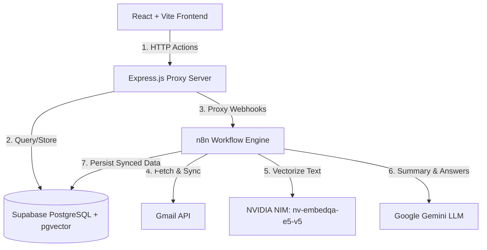

# 📐 Architecture & Design Document: Repeatless Gmail Agent

This document outlines the system architecture, database schema, AI capabilities, synchronization strategy, and design decisions behind the **Repeatless Gmail Agent** platform. Written in an interview-ready, in-depth format, it walks through the technical trade-offs and production-level constraints considered during development.

---

## 1. System Architecture

The Repeatless Gmail Agent follows a decoupled, proxy-oriented architecture designed to handle secure communication, asynchronous synchronization, and semantic query execution.



### Detailed Component Interaction Flow
1. **User Dashboard Actions**: The user interacts with the React frontend (running on Vite). They can view threads, search emails, chat with the AI assistant, or trigger a mailbox refresh sync.
2. **CORS & Gateway Proxy (Express.js)**:
   > [!IMPORTANT]
   > **n8n Webhook CORS Limitation**: The n8n automation engine operates trigger nodes that do not pass browser preflight OPTIONS requests, blocking client-side browser requests. To circumvent this, the Express server acts as a proxy gateway. The React client calls Express endpoints (`/api/emails/compose` and `/api/emails/reply`), which route requests securely to n8n server-to-server, bypassing CORS.
3. **Data Storage & Sync**: When a sync is triggered, the Express backend proxies the sync request to n8n. n8n reads from the **Gmail API**, writes the raw message data, structures threads, generates embeddings, and saves everything directly to **Supabase**.
4. **Conversational RAG Chat**: The client inputs a question. The query is converted into an embedding using NVIDIA NIM, and a cosine distance query executes against Supabase's `pgvector` index to pull the top $K$ relevant email contexts. The retrieved context and user prompt are passed to Google Gemini, which compiles a structured response complete with source citations.

---

## 2. Database Schema Design

The storage layer is built using a PostgreSQL instance hosted on Supabase, leveraging the `pgvector` extension for storing and querying text embeddings.

```sql
-- Enables semantic similarity vector searches
CREATE EXTENSION IF NOT EXISTS vector;
```

### Schema Diagram and Entity Relationships

```
+------------------------------------+          +-----------------------------------------+
|              threads               |          |                 emails                  |
+------------------------------------+          +-----------------------------------------+
| id (VARCHAR, PK)                   |<---------| id (VARCHAR, PK)                        |
| subject (TEXT)                     |  1 to N  | thread_id (VARCHAR, FK)                 |
| sender (TEXT)                      |          | sender (TEXT)                           |
| date (TIMESTAMPTZ)                 |          | recipient (TEXT)                        |
| snippet (TEXT)                     |          | subject (TEXT)                          |
| category (VARCHAR)                 |          | date (TIMESTAMPTZ)                      |
| summary (TEXT)                     |          | snippet (TEXT)                          |
| created_at / updated_at (TIMESTAMPTZ)|        | body (TEXT)                             |
+------------------------------------+          | sanitized_body (TEXT)                   |
                                                | word_count (INTEGER)                    |
                                                | tech_stack_tally (JSONB)                |
                                                | pipeline_version (VARCHAR)              |
                                                | embedding (VECTOR(1024))                |
                                                | created_at (TIMESTAMPTZ)                |
                                                +-----------------------------------------+
```

### Data Modeling Decisions
- **Normalized Threads and Emails**: Gmail naturally groups emails by a unique `threadId`. Mirroring this relationship (`threads` as parent, `emails` as children referencing `thread_id` with `ON DELETE CASCADE`) ensures structured access patterns. We can display an overview of thread summaries, and lazily load individual message logs.
- **Sanitized Body (`sanitized_body`)**: Raw emails are cluttered with HTML boilerplate, base64 attachments, legal footers, and infinite reply trails (nested `>` quotes). During indexing, we sanitize the text, stripping formatting and historical quotes to store a raw text representation. This reduces database size, token overhead during LLM context feeding, and embedding noise.
- **Infrastructure Tally (`tech_stack_tally` JSONB)**: Stores metadata tallies (e.g. system configurations, software tools, or keywords found) in a flexible semi-structured JSONB format, permitting schema-less query expansion.
- **1024-Dimension Embeddings**: Configured precisely for the **NVIDIA NIM `nv-embedqa-e5-v5`** retrieval embedding model.

### Indexing Strategies
To optimize read operations and vector similarity queries, the database implements target indexing:
- **Standard Indexes**:
  - `idx_emails_thread_id` on `emails(thread_id)`: Accelerates fetching all messages belonging to a selected thread.
  - `idx_emails_date` and `idx_threads_date`: Optimizes default chronological landing page listings.
  - `idx_threads_category`: Accelerates dashboard category filtering (Work, Finance, Newsletters).
- **HNSW Vector Index**:
  ```sql
  CREATE INDEX IF NOT EXISTS idx_emails_embedding_hnsw 
  ON emails USING hnsw (embedding vector_cosine_ops);
  ```
  We use the **Hierarchical Navigable Small World (HNSW)** index rather than IVFFlat. HNSW provides faster query retrieval speeds at scale by building a multi-layer graph. It operates with cosine similarity operations (`vector_cosine_ops`), which yields optimal semantic comparison performance.

---

## 3. AI Design & RAG Pipeline

### 3.1. Email Summarization Strategy
- **Chunking & Thread-Level Context**: Instead of summarizing emails in isolation, summaries are generated at the **thread level**. In a thread, context builds sequentially.
- **Token Optimization**: 
  1. We fetch all emails in the thread.
  2. We extract the `sanitized_body` from each message.
  3. We order messages chronologically and prefix each message with a header showing the `Sender` and `Date`.
  4. Since the context window of modern LLMs (like Google Gemini) easily spans hundreds of thousands of tokens, we feed the entire thread context directly into the prompt without chunking where possible. 
  5. If an abnormally long thread exceeds limits, we run a rolling-window summarization: summarizing chunks of 5 messages at a time and recursively condensing the summaries.

### 3.2. Retrieval-Augmented Generation (RAG) Pipeline

```
[User Query] 
     │
     ▼
[NVIDIA NIM: nv-embedqa-e5-v5] ──► (Generate 1024-Dim Vector)
                                             │
                                             ▼
                                  [Supabase pgvector] 
                                  - Cosine Distance Search
                                  - Retrieve Top K Email Snippets
                                             │
                                             ▼
                                  [Prompt Construction]
                                  - System Instructions
                                  - Retrieved Context
                                  - Unique Citations [1], [2]
                                             │
                                             ▼
                                  [Google Gemini LLM] ──► [Structured Response + UI Citation Badges]
```

1. **Embedding generation**: When a user queries the chatbot, the backend routes the query text to the **NVIDIA NIM `nv-embedqa-e5-v5`** model to generate a 1024-dimensional semantic embedding vector.
2. **Vector Similarity Query**: The database runs a cosine similarity lookup using the `pgvector` operator:
   ```sql
   SELECT id, subject, sender, date, snippet 
   FROM emails 
   ORDER BY embedding <=> user_query_embedding 
   LIMIT K;
   ```
3. **Retrieval Constraint (K-Value)**: We set $K = 5$ to $8$ to ensure high-density relevant information is pulled while leaving ample room for user conversational context.

### 3.3. Source Clarity & Citation Mapping
To ensure that the assistant remains transparent, the context fed into the LLM prompt is formatted as structured JSON or numbered blocks:
```text
Email [1]:
Sender: john@example.com
Date: 2026-06-19
Subject: Project Update
Content: ...
```
The system instructions mandate that the model **must cite every assertion** by appending the bracketed index (e.g., `[1]`, `[2]`) referencing the source block. The frontend parses these bracketed expressions dynamically and renders them as interactive Lucide UI badges. Clicking a badge highlights the specific email thread context in the dashboard, giving users immediate verification.

### 3.4. Choice of NVIDIA NIM Models
- **`nvidia/nv-embedqa-e5-v5`**: This model is optimized for text retrieval and question-answering tasks. It outperforms standard models on MTEB benchmarks and maps search queries to retrieval keys with high accuracy, ensuring relevant emails are surfaced.
- **NVIDIA Inference Infrastructure**: Using NVIDIA NIM containers provides standard API schemas, fast response times (low time-to-first-token), and hardware-accelerated embedding generation.

### 3.5. Hallucination and Context-Bleeding Prevention
- **Context Boundaries**: The system instructions explicitly restrict the model to the provided text context:
  > *"You are an AI Email Assistant. You must answer the user's questions using ONLY the email database context provided below. If the emails do not contain the answer, reply stating you cannot find the information in the inbox. Do not reference external facts or generate hypothetical scenarios."*
- **Source Grounding**: By forcing the model to issue citations (`[1]`), we prevent it from fabricating details. If a sentence has no citation, the system flags it or the user can immediately tell it lacks backing data.

---

## 4. Gmail API Strategy

Interacting with the Gmail REST API requires strict quota management, pagination controls, and synchronization strategies.

### 4.1. Initial vs. Incremental Sync
- **Initial Sync (Historical Bulk Load)**:
  - The worker requests `userId/messages` with a page limit (e.g. 100 messages per request) up to a max history depth (e.g., last 30 days).
  - It fetches headers in pages, extracts `threadId` keys, dedupes the thread IDs, and triggers batch message fetches for details.
  - The processed threads, emails, and generated vector embeddings are saved to Supabase.
- **Incremental Sync (Delta Capture)**:
  - We store the latest `historyId` or timestamp inside a synchronization status table.
  - Subsequent sync triggers invoke the Gmail API using the query filter `q=after:TIMESTAMP` or check the `historyId` endpoint.
  - This retrieves only message additions, changes, or deletions since the last sync execution, reducing API consumption and processing overhead.

### 4.2. Pagination Handling
Large mailboxes are retrieved page-by-page by passing the returned `nextPageToken` back to subsequent API calls:
1. Make a request to the Gmail endpoint.
2. Store the returned items.
3. If `nextPageToken` is returned, make the next call containing `pageToken=nextPageToken`.
4. The fetch loop terminates when `nextPageToken` is undefined or we reach our pre-configured maximum page processing limit.

### 4.3. Quota & Rate Limit Handling
Google Gmail API enforces a daily limit of 1,000,000 quota units and a per-second rate limit of 250 units.
- **Quota Conservation**: List endpoints are cheap (5 units), but individual message get requests are expensive (10 units). We batch message fetch operations using HTTP batching mechanisms or concurrent, rate-limited Promise pools.
- **Exponential Backoff**: When encountering an HTTP `429 (Too Many Requests)` or `503 (Service Unavailable)`, the worker waits $2^x + \text{jitter}$ seconds before retrying, preventing retry cascades.

---

## 5. Tool & Technology Decisions

- **React + Vite**:
  - *Decision*: Decoupled single-page application (SPA).
  - *Justification*: Vite provides fast HMR (Hot Module Replacement) and compilation times during development, and compiles into lightweight, static asset bundles that deploy onto CDNs like Vercel with zero cold starts.
- **Express.js (Node.js)**:
  - *Decision*: Minimal server framework.
  - *Justification*: Serves as a secure API Gateway proxy, handles CORS validation dynamically against allowed deployment hosts, and forwards webhook calls to n8n.
- **n8n Workflow Engine**:
  - *Decision*: Visual orchestrator.
  - *Justification*: Replaces hundreds of lines of complex node code for setting up OAuth redirect pages, polling schedules, mapping Gmail structures, and coordinating Gemini LLM calls. It provides visual debugging and instant scaling of integration pipelines.
- **Supabase + pgvector**:
  - *Decision*: Relational Database with built-in vector support.
  - *Justification*: Simplifies our tech stack by avoiding the need to run and pay for a separate vector database (e.g., Pinecone or Milvus). We can execute standard SQL queries joining relational email metadata (date, category, sender) with vector distance operations in a single query.

---

## 6. Trade-offs & Limitations

### 6.1. Development Bypasses & Simplifications
- **OAuth Bypassing**: To create a seamless sandbox test workspace for evaluators, real OAuth callback redirections are bypassed. On connection, the client connects to a dedicated profile (`anupojubhavani9849@gmail.com`). In a production system, a multi-tenant OAuth state engine is required, storing encrypted Access and Refresh Tokens in a secured `users_tokens` database table.
- **Static Mock Synchronization**: In the absence of live credentials, the synchronize endpoint runs simulated sync routines returning static email threads.

### 6.2. Architectural Bottlenecks & Future Work
- **Synchronous Sync Webhooks**: The current sync endpoint blocks the client HTTP request until n8n returns. For large mailboxes, this connection will time out. A production-ready design would utilize an asynchronous event pattern: the sync request immediately returns a task ID (`HTTP 202 Accepted`), kicks off background jobs in a queue manager (like BullMQ / Redis), and pushes progress status updates to the client via WebSockets or Server-Sent Events (SSE).
- **Reranking**: Currently, search query candidates are ordered solely by vector cosine similarity. High similarity text can sometimes be outdated. Adding a **reranking step** (using a Cohere Rerank model) would compute scores evaluating both semantic match and chronological recency, improving AI answer accuracy.
