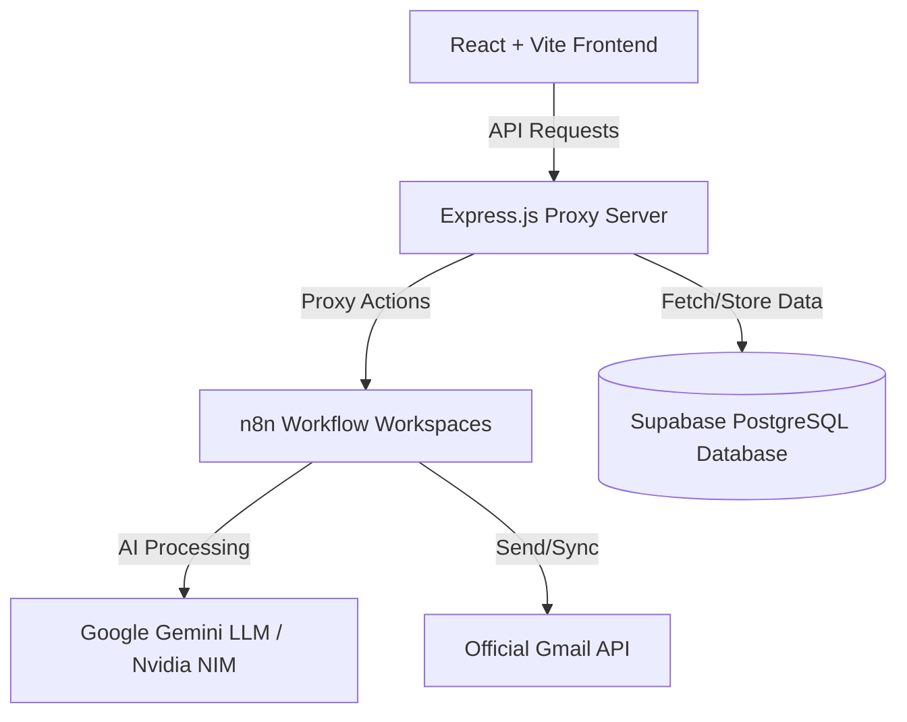

# 📨 Repeatless Gmail Agent

An AI-powered email intelligence dashboard and RAG conversational assistant. This application connects to Gmail, synchronizes email threads, performs automatic categorization (Work, Finance, Newsletters), and generates instant summarized insights. Users can draft new replies or compose emails with Gemini AI agents using an intuitive UI.

---

## 🏗️ Architecture Overview

The system is built on a modern decoupled architecture:



### Key Architectural Pillars:
1. **Frontend (React + Vite + Tailwind CSS)**: A fully responsive, mobile-first dashboard. On mobile screens, the Chat assistant panel takes center stage, and the Inbox pane is contained in an overlay navigation drawer toggled by a hamburger menu.
2. **Backend (Express.js Proxy Server)**: Serves as a gateway, database mapper, and proxy routing system.
   > [!NOTE]
   > **n8n Webhook CORS Proxying**: n8n webhook triggers reject CORS preflight OPTIONS requests from browsers. To solve this, all compose and reply actions from the browser are routed through the Express proxy server (`/api/emails/compose` and `/api/emails/reply`), which executes secure server-to-server HTTP calls to the n8n webhook nodes.
3. **Database (Supabase PostgreSQL)**: Stores structured email metadata, body messages, categories, quick summaries, and sync tracking states.
4. **Workflows (n8n Automation)**: Coordinates RAG indexing, sync schedules, AI-powered classification, and draft dispatching to the Gmail API.

---

## 📁 Repository Structure

```directory
repeatless-project/
├── backend/                  # Express.js backend server
│   ├── controllers/          # Business logic handlers (auth, sync, emails, chat)
│   ├── routes/               # API route definitions
│   ├── server.js             # Server entry point
│   ├── schema.sql            # Database schema for Supabase
│   └── package.json          # Node server dependencies
├── frontend/                 # React frontend application
│   ├── src/
│   │   ├── components/       # UI Components (Header, InboxPane, ChatPane)
│   │   ├── utils/            # Axios API config & text clean helpers
│   │   ├── App.jsx           # Main workspace coordinator
│   │   ├── main.jsx          # React app mount
│   │   └── index.css         # Global stylesheet & Tailwind layers
│   ├── tailwind.config.js    # Design system and typography setup
│   └── package.json          # Web app dependencies
├── .env.example              # Sample environment template (Root)
└── README.md                 # Project documentation
```

---

## 🔑 Environment Configuration

A `.env.example` file is included in the root directory. Configure your variables inside `/backend/.env` and `/frontend/.env`:

### Backend Environment Variables (`/backend/.env`)

| Variable | Description |
| :--- | :--- |
| `PORT` | Local port number for the Express API server (Default: `5000`). |
| `NODE_ENV` | Environment phase name (`development` or `production`). |
| `FRONTEND_URL` | URL of the frontend client (used for CORS whitelist registration). |
| `GOOGLE_CLIENT_ID` | Google OAuth Client ID for Gmail API authentication. |
| `GOOGLE_CLIENT_SECRET` | Google OAuth Client Secret. |
| `GOOGLE_CALLBACK_URL` | OAuth redirect URI callback URL. |
| `SUPABASE_URL` | URL of the Supabase PostgreSQL database project. |
| `SUPABASE_ANON_KEY` | Anonymous API access key for Supabase PostgREST endpoints. |
| `GEMINI_API_KEY` | API authentication key for Google Gemini model generation. |
| `NVIDIA_NIM_API_KEY` | API authentication key for NVIDIA NIM API endpoint. |
| `N8N_SYNC_WEBHOOK_URL` | Webhook to trigger Gmail synchronization workflows. |
| `N8N_CHAT_WEBHOOK_URL` | Webhook to forward RAG-based AI assistant queries. |
| `N8N_COMPOSE_WEBHOOK_URL`| Webhook handling email drafting/generation. |
| `N8N_REPLY_WEBHOOK_URL`  | Webhook handling email reply drafting/generation. |

### Frontend Environment Variables (`/frontend/.env`)

| Variable | Description |
| :--- | :--- |
| `VITE_API_URL` | The REST API endpoint of the Express backend server (e.g. `http://localhost:5000/api`). |
| `VITE_N8N_CHAT_WEBHOOK_URL` | Fallback chat query endpoint. |
| `VITE_N8N_COMPOSE_WEBHOOK_URL` | Fallback compose draft query endpoint. |
| `VITE_N8N_REPLY_WEBHOOK_URL` | Fallback reply draft query endpoint. |

---

## 🚀 Local Installation and Setup

### Prerequisites
- [Node.js](https://nodejs.org/) (v16+ recommended)
- [npm](https://www.npmjs.com/) (installed automatically with Node)

---

### Step 1: Clone and Configure Environment Files
1. Clone this repository to your workspace.
2. In the `/backend` folder, create a `.env` file based on the root `.env.example`.
3. In the `/frontend` folder, create a `.env` file:
   ```env
   VITE_API_URL=http://localhost:5000/api
   ```

---

### Step 2: Set Up and Run the Backend Server
1. Navigate to the backend directory:
   ```bash
   cd backend
   ```
2. Install npm dependencies:
   ```bash
   npm install
   ```
3. Start the development server:
   ```bash
   npm start
   ```
The backend server will run on `http://localhost:5000`.

---

### Step 3: Set Up and Run the Frontend Client
1. Open a new terminal window and navigate to the frontend directory:
   ```bash
   cd frontend
   ```
2. Install npm dependencies:
   ```bash
   npm install
   ```
3. Start the Vite development build server:
   ```bash
   npm run dev
   ```
Open `http://localhost:5173` in your browser.

---

## 🎨 UI Refinement Details

- **Mobile Responsiveness**: Dynamic CSS grid layout that displays only the chat dashboard on small viewports and hides the email inbox panel. Users tap a hamburger menu button to slide in the email list from the left in a sleek overlay drawer. Clicking emails or clicking the "Compose" action automatically closes the drawer.
- **Micro-Animations**: Keyframe slide transitions (`slideRight`) for drawers, scale fade-in animations for modal components with spring easing (`scaleUp`), and centralized floating success alerts with status checkmarks.
- **Customization Alert**: In order to prevent unauthorized access or visual demo confusion, the client is locked to a single customized Gmail inbox profile (`anupojubhavani9849@gmail.com`). Triggering new email connections displays an alert warning explaining customization configurations.
